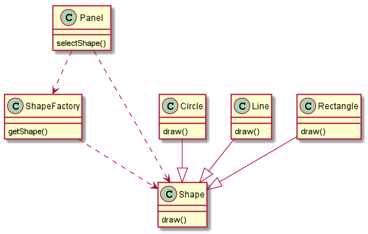
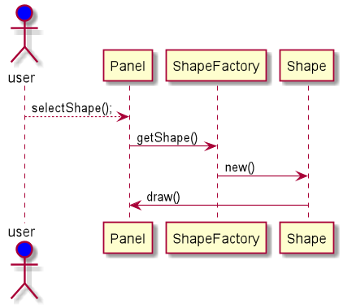

# UML

## 概述

###1.UML 主要元素

- UML 基本构造块
- 支配构造快放在一起的规则
- 运用于整个UML的公共机制

#### 1.1 基本构造块

1)	事物

2) 	关系

3) 	图

**事物是对模型中最具代表性成分的抽象，关系将事物结合在一起，图聚集了相关的事物**

UML中的事物

- 结构事物
- 行为事物
- 分组事物
- 注释事物

#### 1.2 结构事物

- 1.类 ： 对一组具有相同属性，行为，关系，语义的对象的描述。一个类实现到了一个或多个接口用矩形表示
- 2.接口:描述一个类或构件的一个服务的操作集合。接口描述元素的外部可见行为，带有名称的圆表示
- 3.协作：定义了一个交互，有一组共同工作以提供某种协作行为的角色和其他元素构成的一个群体。虚线椭圆
- 4.用例：对一组动作序列的描述，系统执行这些动作将产生一个对待特定的参与者有价值可观察的结果，实现椭圆
- 5.主动类：其对象至少拥有一个进程/线程，因此他可以启动控制活动。与类一致，外框使用粗线
- 6.构件：描述物理事物，是系统中可替代的部分，它遵循且提供一组接口的实现。通常构件是一个描述了一些逻辑元素（类，接口，协作等）的物理包。带有小方块的矩形。
- 7.节点：在运行时存在的物理元素，表示一种可计算的资源，通常有一些记忆/计算能力。一个构件集可以驻留在一个节点内，立方体表示

#### 1.3行为事物

时UML的动态部分。

- 交互：由在特定语境中共同完成一定任务的一组对象之间交换的消息组成
- 状态机：它描述了一个对象或一个交互在生命期内响应事件所经历的状态序列

#### 1.4分组事物

UML中的组织部分

- 包:是把元素组织成组的机制，它纯粹是概念上的，仅在开发时存在

#### 1.4注释事物

是U M L模型的解释部分

### 2.UML 关系

- 依赖
- 泛化
- 关联
- 实现

1997 OMG(Object Management Group) 发布的统一建模语言UML(Unified Modeling Language).

UML 采用一些标准图形元素来直接直观地表示对象模型。所以他是一种可视化的面向对象建模语言。

UML  包含的图例类型：

- 用例图：use case diagram ， 从用户的角度描述系统功能
- 类图：class diagram， 描述对象模型中类之间的关系
- 时序图：sequence diagram， 描述对象之间的动态交互关系，强调对象之间发送消息的时间顺序
- 协作图：cooperation diagram，描述对象之间的协作关系 
- 状态转换图：state transition diagram， 描述对象所有可能的状态，以及导致状态转换的转移条件
- 组件图：component diagram， 描述系统中各个软件组件之间的依赖关系，还可以描述软件组件的源代码的组织结构
- 部署图：deployment diagram，定义系统中软硬件的物理体系结构。他可以显示实际的计算机和设备，以及他们之间的连接关系，在节点中，还可以显示软件组件在硬件环境中的布局

| Static Diagram,静态模型 | Dynamic Diagram,动态模型 |
| ------------------- | -------------------- |
| 用例图                 | 时序图                  |
| 类图                  | 协作图                  |
| 组件图                 | 状态转换图                |
| 部署图                 |                      |

## 1.Use Case Diagram, 用例图

### 1.内容

用例图描述系统提供的功能。主要目的是帮助开发团队以一种可视化的方式来理解系统的功能需求

- 角色：系统的边界，使用系统特定功能的用户，**人形符合**表示
- 用例：表示系统的某个功能，**椭圆符号**表示
- 角色-用例关系：角色和用例之间的使用关系，**实线箭头**表示
- 用例之间的关系：用例之间可能存在包含/扩展关系，包含指一个用例包含另一个用例的功能，扩展指一个用例继承另一个用例的功能。

### 2.用例文档

在软件分析和设计阶段，还要分析用例的细节和处理流程，以文档的形式来描述用例，用例文档中应当包含一些类容：

- 前置条件：开始用这个用例前必须满足的条件
- 主流事件：用例的正常流程
- 其他事件流：用例的非正常流程，如错误流
- 后置条件：用例完毕之后必须为真的条件，并非每个用例都有后置条件

## 2.Class Diagram, 类图

### 1.内容

- 类: **矩形**表示，矩形上层表示类名，中层表示属性，下层表示方法。抽象类/方法用斜体字表示，
- 类之间的关系：关联，依赖，聚集，泛化

## 3.Sequence Diagram, 时序图

时序图显示用例的详细流程。

- 水平维度：显示对象之间发送消息的过程
- 垂直维度：显示发送消息的时间顺序

## 4.Cooperation Diagram,协作图

